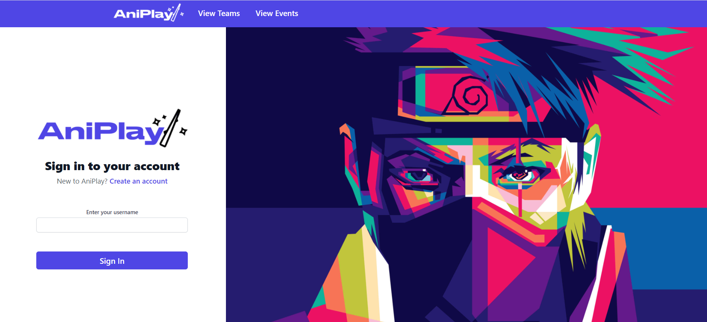
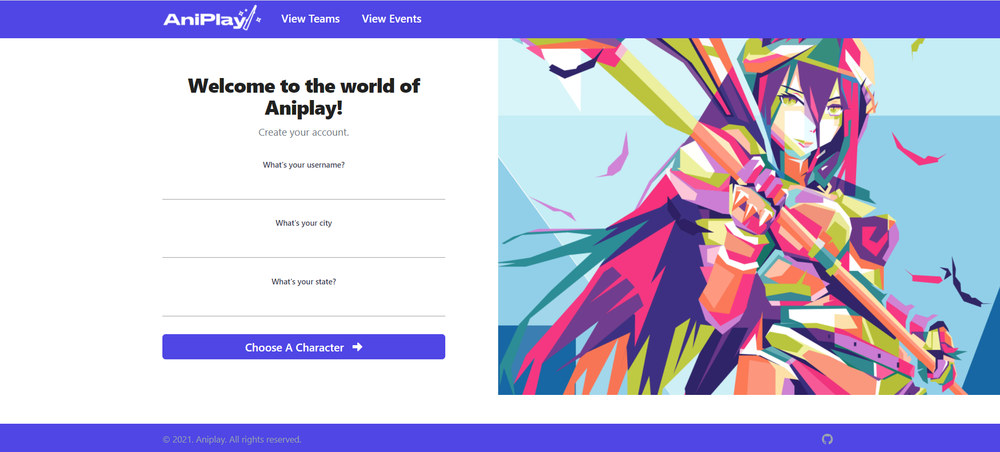
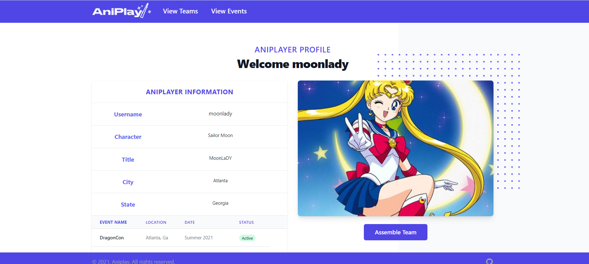

# Aniplay 🎆

# Table of Contents

* [About the Project](#about-the-project)
* [Built With](#built-with)
* [Getting Started](#getting-started)
* [Installation](#installation)
* [Usage](#usage)
* [Contributing](#contributing)
* [License](#license)
* [Contact](#contact)

## About the Project 

Are you a lover of cosplay and Anime? The application Aniplay is the perfect application to find and connect with your fellow cosplayers. Currently, there is a missing link in connecting with other cosplayers. This application not only allows you to search and find other cosplayers but also enables you to connect directly with them and plan to attend upcoming cosplay events. Aniplay will allow people the opportunity to build the perfect team for like minded individuals who love the same or similar anime characters. Aniplay also hosts an events section that will be regularly updated with upcoming events and allow users to plan to attend these events with their team members.

[View the deployed application here]()

## Built with 

These were the major frameworks used to build this application:  

* Javascript  
* CSS 
* MongoDB
* React JS 
* Express 
* Mongoose
* Heroku    
* Figma
* Tailwinds  
* Shutterstock images 
* Jikan API 
* Font Awesome

## Getting Started 

### Prerequisites 

`npm init -y`

`npm install axios express mongoose`

### Installation 
To get a local copy up and running follow these simple example steps.

1.  `Clone the repo`
    `git clone https://github.com/your_username_/Project-Name.git`

2.  `Install NPM packages`

3.  `npm install`

4. `npm start`

5. `run application in your local host`

### Usage 

As a user, I want an application that allows me to connect with other cos players to create teams and attend future events. I can create an account or login as a current user. After creating an account, I can build a team of anime characters and search for future events to attend with my team.

### Contributing

The following individuals contributed to the success of this application. You can view their Github profiles by clicking on their names:

* [Daniel Guadalupe](https://github.com/danielthomas129)

* [Selena Singleton](https://github.com/ssingle7)

* [Lisa Copeland](https://github.com/stopdaydreaming)  

* [Derrick Hardison](https://github.com/derrickhardison) 

The following sites were used to make Aniplay a functioning application: 

* [Aneme Cons](https://animecons.com/events/schedule.php?year=2021)    

* [Font Awesome](https://fontawesome.com/pro)        

* [Shutterstock](https://www.shutterstock.com/)

### License  

 

    

MIT License
Copyright (c) 2021 Daniel Guadalupe, Selena Singleton, Lisa Copeland, Derrick Hardison. 
Permission is hereby granted, free of charge, to any person obtaining a copy
of this software and associated documentation files (the "Software"), to deal
in the Software without restriction, including without limitation the rights
to use, copy, modify, merge, publish, distribute, sublicense, and/or sell
copies of the Software, and to permit persons to whom the Software is
furnished to do so, subject to the following conditions:
The above copyright notice and this permission notice shall be included in all
copies or substantial portions of the Software.
THE SOFTWARE IS PROVIDED "AS IS", WITHOUT WARRANTY OF ANY KIND, EXPRESS OR
IMPLIED, INCLUDING BUT NOT LIMITED TO THE WARRANTIES OF MERCHANTABILITY,
FITNESS FOR A PARTICULAR PURPOSE AND NONINFRINGEMENT. IN NO EVENT SHALL THE
AUTHORS OR COPYRIGHT HOLDERS BE LIABLE FOR ANY CLAIM, DAMAGES OR OTHER
LIABILITY, WHETHER IN AN ACTION OF CONTRACT, TORT OR OTHERWISE, ARISING FROM,
OUT OF OR IN CONNECTION WITH THE SOFTWARE OR THE USE OR OTHER DEALINGS IN THE
SOFTWARE.